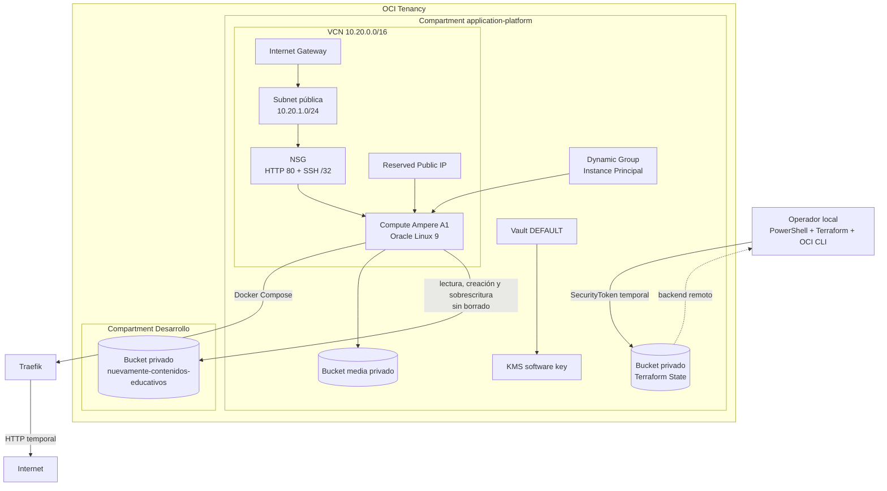

# Caso práctico: plataforma OCI para NuevaMente

Este documento describe la infraestructura desplegada para preparar el entorno
de desarrollo de NuevaMente en Oracle Cloud Infrastructure (OCI). La aplicación
todavía no forma parte de este repositorio: aquí se versiona exclusivamente la
infraestructura reutilizable y la evidencia técnica del despliegue.

La composición genérica derivada de este despliegue está documentada en
[`oci/reference-architectures/single-vm-multi-app`](../reference-architectures/single-vm-multi-app/).

El trabajo excede el alcance mínimo del ticket de Object Storage, pero aporta:

- reproducibilidad mediante Terraform;
- separación entre infraestructura y aplicación;
- control de cambios y revisión antes de aplicar;
- credenciales y state fuera de Git;
- una base reutilizable para alojar más proyectos;

## Estado alcanzado

La plataforma de desarrollo quedó desplegada y lista para recibir NuevaMente.
El despliegue real produjo:

- `17` recursos creados;
- `0` recursos modificados;
- `0` recursos destruidos;
- `0` reemplazos;
- un plan posterior con `No changes`;
- una respuesta HTTP `404` de Traefik, resultado esperado antes de registrar una
  aplicación.

La IP pública no se fija en la documentación. Se obtiene siempre desde el state:

```powershell
terraform output -raw server_public_ip
```

## Alcance actual

La infraestructura desplegada incluye:

- compartment independiente para la plataforma;
- bucket privado y versionado dedicado a Terraform Remote State;
- VCN, Internet Gateway, route table, security list y subnet pública;
- Network Security Group con HTTP público y SSH restringido a una IP `/32`;
- una instancia `VM.Standard.A1.Flex` con `1` OCPU y `6 GB` de memoria;
- boot volume de `50 GB`;
- Reserved Public IP;
- Docker Engine y Docker Compose instalados mediante cloud-init;
- Traefik ejecutándose como proxy inverso;
- OCI Vault de tipo `DEFAULT` y una clave KMS protegida por software;
- bucket privado de medios separado del bucket de Terraform State;
- Dynamic Group e IAM policies para Instance Principal;
- acceso limitado desde la VM al bucket privado de contenidos educativos que ya
  existía en el compartment `Desarrollo`;
- state remoto independiente para el entorno `dev`.

Las siguientes capacidades permanecen desactivadas para reducir costo y
complejidad durante esta etapa:

- Monitoring y Notifications;
- Logging centralizado;
- backups administrados;
- OCI Container Registry;
- deployment mediante OCI Run Command.

La plataforma está preparada para habilitarlas más adelante mediante variables,
sin duplicar los archivos Terraform.

## Arquitectura desplegada



## Modelo de compartments

Se conservaron dos responsabilidades distintas:

| Compartment | Responsabilidad |
|---|---|
| `application-platform` | Plataforma compartida administrada por esta IaC: red, Compute, Vault, bucket media y Terraform State. |
| `Desarrollo` | bucket de NuevaMente creado en el ticket NM-02 |

El bucket del equipo no se movió ni se recreó. La plataforma accede a él mediante
una policy específica que limita:

- el compartment de destino;
- el nombre exacto del bucket;
- las operaciones permitidas;
- el principal que realiza el acceso.

El perfil `READ_WRITE` utilizado permite inspeccionar, leer, crear y sobrescribir
objetos. No concede eliminación de objetos. El bucket de Terraform State nunca se
comparte con aplicaciones.

## Por qué se ejecutó desde PowerShell

La primera intención fue ejecutar Terraform desde OCI Cloud Shell. Cloud Shell
autentica su OCI CLI con un principal delegado denominado `instance_obo_user`.
Ese mecanismo sirve para muchos comandos interactivos de OCI CLI, pero no es un
método de autenticación expuesto por el provider OCI de Terraform.

No debía sustituirse por `InstancePrincipal`:

- `instance_obo_user` representa al usuario delegado dentro de Cloud Shell;
- `InstancePrincipal` representa la identidad de una instancia Compute;
- son mecanismos distintos y no tienen necesariamente los mismos permisos IAM.

Al intentar crear el compartment con `InstancePrincipal`, Identity respondió
`404 NotAuthorizedOrNotFound`. También se comprobó que pasar el token OBO como
cabecera genérica no convertía al provider en un cliente compatible con ese flujo.

La solución utilizada fue una sesión local temporal:

```powershell
oci session authenticate `
  --region sa-saopaulo-1 `
  --profile-name TERRAFORM
```

Este comando abre el navegador, autentica al usuario y crea un `SecurityToken`
temporal en el perfil local `TERRAFORM`. Terraform consume ese perfil mediante:

```hcl
oci_auth                = "SecurityToken"
oci_config_file_profile = "TERRAFORM"
```

Ventajas de este enfoque:

- no crea API keys permanentes para la operación;
- no almacena claves privadas ni tokens en Git;
- el token expira y puede renovarse;
- Terraform actúa con la identidad del usuario autenticado;
- permite revisar y aplicar desde una terminal controlada localmente.

Cuando el token vence, se renueva repitiendo `oci session authenticate`. No se
debe copiar el token a `terraform.tfvars`, al backend ni a la documentación.

## Organización de la infraestructura como código

La solución se divide en dos root modules independientes.

### 1. Platform Bootstrap

Ruta: `oci/platform-bootstrap`

Responsabilidad:

- crear el compartment `application-platform`;
- consultar el namespace de Object Storage a nivel tenancy;
- crear el bucket privado y versionado de Terraform State;
- entregar los valores necesarios para configurar el backend remoto.

Este bootstrap mantiene state local porque administra el bucket en el que luego
se guardará el state de la plataforma. Su state no debe almacenarse dentro del
bucket que él mismo crea.

Archivos principales:

| Archivo | Función |
|---|---|
| `compartment.tf` | Crea el compartment de plataforma. |
| `storage.tf` | Consulta el namespace y crea el bucket de state. |
| `providers.tf` | Configura el provider OCI según variables. |
| `variables.tf` | Declara parent compartment, nombres, región y autenticación. |
| `outputs.tf` | Expone compartment, namespace, bucket y valores del backend. |

### 2. Docker Platform

Ruta: `oci/docker-platform`

Responsabilidad:

- crear la plataforma de ejecución;
- usar el backend remoto creado por el bootstrap;
- mantener un código común para `dev`, `staging` y `prod`;
- habilitar componentes opcionales mediante variables.

Archivos principales:

| Archivo | Función |
|---|---|
| `network.tf` | Orquesta VCN, gateway, rutas, subnet, security list y NSG. |
| `compute.tf` | Crea Compute, consulta VNIC/private IP y asigna la IP reservada. |
| `iam.tf` | Define Dynamic Group y policies de acceso mínimo. |
| `vault.tf` | Orquesta Vault y KMS. |
| `storage.tf` | Crea el bucket media separado del state. |
| `backup.tf` | Backups opcionales del boot volume. |
| `logging.tf` | Logging opcional con OCI Logging y agente. |
| `observability.tf` | Alarmas y notificaciones opcionales. |
| `registry.tf` | Repositorios privados opcionales en OCIR. |
| `deployment.tf` | IAM opcional para el mecanismo seguro de deployment. |
| `environment.tf` | Controles diferentes para dev, staging y prod. |
| `cloud-init/bootstrap.yaml.tftpl` | Instala y configura el sistema operativo. |
| `proxy/docker-compose.yml.tftpl` | Define Traefik y la red Docker compartida. |

Los componentes reutilizables están en `oci/modules`. El root conecta módulos y
mantiene en él las responsabilidades transversales, especialmente Compute e IAM.

## Proceso de despliegue realizado

### 1. Prerrequisitos locales

- Terraform compatible con `>= 1.5.7` y `< 2.0.0`;
- OCI CLI;
- Git;
- PowerShell;
- navegador para la autenticación temporal;
- una clave SSH local dedicada, fuera de Git y con permisos de archivo
  restringidos al usuario, Administradores y SYSTEM.

Comprobación:

```powershell
terraform version
oci --version
git --version
```

### 2. Autenticación temporal

```powershell
oci session authenticate `
  --region sa-saopaulo-1 `
  --profile-name TERRAFORM
```

El perfil se verifica sin imprimir el token:

```powershell
oci iam region-subscription list `
  --profile TERRAFORM `
  --auth security_token `
  --query "data[].\"region-name\""
```

### 3. Configuración local del bootstrap

Desde `oci/platform-bootstrap`:

```powershell
Copy-Item terraform.tfvars.example terraform.tfvars
```

Se completa `terraform.tfvars` con los identificadores reales y el perfil
temporal. Ese archivo está ignorado por Git.

```powershell
terraform init
terraform fmt -check -recursive
terraform validate
terraform plan -out bootstrap.tfplan
terraform apply bootstrap.tfplan
```

Después se comprueba idempotencia:

```powershell
terraform plan -detailed-exitcode
```

El exit code esperado es `0`, equivalente a `No changes`.

### 4. Preparación del backend de dev

Desde `oci/docker-platform` se crean archivos locales a partir de los ejemplos:

```powershell
Copy-Item `
  environments/dev/backend.oci.tfbackend.example `
  environments/dev/backend.oci.tfbackend

Copy-Item `
  environments/dev/terraform.tfvars.example `
  environments/dev/terraform.tfvars
```

El backend usa una clave exclusiva para dev:

```hcl
key = "docker-platform/dev/terraform.tfstate"
```

Los valores reales de bucket, namespace, OCIDs, perfil y red autorizada se
completan únicamente en los archivos ignorados.

### 5. Inicialización y validaciones

```powershell
terraform init -reconfigure `
  -backend-config environments/dev/backend.oci.tfbackend

terraform fmt -check -recursive
terraform validate
```

También se ejecutaron:

- tests de Policy as Code;
- tests de Container Hardening;
- Checkov con el perfil `dev`;
- validación YAML y Python;
- `git diff --check`.

Resultado de Policy as Code:

- `PASS`;
- `0` findings bloqueantes;
- advertencias esperadas por HTTP temporal y controles reducidos de dev.

### 6. Plan real

```powershell
terraform plan `
  -var-file environments/dev/terraform.tfvars `
  -out dev.tfplan
```

Antes de aplicar se inspeccionó el plan JSON para confirmar que no existieran
acciones `delete` ni secuencias de reemplazo `delete,create`.

Resultado revisado:

```text
Plan: 17 to add, 0 to change, 0 to destroy.
```

### 7. Apply controlado

Se aplicó exactamente el plan guardado, sin recalcularlo:

```powershell
terraform apply dev.tfplan
```

Resultado:

```text
Apply complete! Resources: 17 added, 0 changed, 0 destroyed.
```

### 8. Verificación posterior

Se repitió el plan contra el state remoto:

```powershell
terraform plan `
  -var-file environments/dev/terraform.tfvars `
  -detailed-exitcode
```

Resultado:

```text
No changes. Your infrastructure matches the configuration.
```

Traefik se verificó sin fijar la IP en scripts ni documentación:

```powershell
$publicIp = terraform output -raw server_public_ip
curl.exe --dump-header - --output NUL "http://$publicIp/"
```

Antes de registrar una aplicación, Traefik responde `HTTP/1.1 404 Not Found`.
Esto confirma que el proxy está activo; no representa un error de plataforma.

### 9. Verificación de Instance Principal y Object Storage

Se realizó una prueba de extremo a extremo desde la instancia, sin copiar API
keys, auth tokens ni credenciales de usuario al servidor. La OCI CLI utilizó
`--auth instance_principal` para:

1. obtener el namespace de Object Storage;
2. consultar el bucket `nuevamente-contenidos-educativos`;
3. subir `infrastructure-tests/instance-principal.txt`;
4. descargar nuevamente el objeto;
5. comparar el contenido y su SHA-256.

La carga y descarga produjeron el mismo SHA-256:

```text
4f5aa028e539009fbda6cd048ab0648b80db23a45e24d6c5ce485ccbe992b217
INSTANCE_PRINCIPAL_OBJECT_STORAGE_OK
```

Esto valida la ruta completa `VM -> Dynamic Group -> IAM -> Object Storage` y
confirma que la plataforma puede leer y escribir en el bucket creado por NM-02.
No prueba todavía el cliente OCI del backend, que se validará durante el
despliegue de la aplicación.

El objeto de prueba permanece en el bucket como evidencia. La policy de la VM no
incluye eliminación de objetos deliberadamente, por lo que sólo un usuario con
permisos administrativos puede retirarlo.

## Decisiones y correcciones realizadas

### Namespace de Object Storage

El namespace pertenece al tenancy, no al nuevo compartment. Consultarlo pasando
el OCID de un compartment recién creado podía devolver un valor vacío durante el
mismo plan. La consulta quedó correctamente definida a nivel tenancy.

### HTTPS desactivado temporalmente

NuevaMente es un proyecto de equipo y no debe publicarse bajo un dominio personal.
Hasta definir un dominio apropiado se utiliza HTTP en `dev`:

```hcl
https_enabled = false
acme_email    = null
```

El template convierte explícitamente `null` en una cadena vacía sólo para poder
renderizar la configuración cuando HTTPS está desactivado. Staging y producción
continúan exigiendo HTTPS.

### SSH restringido

Aunque el ejemplo de laboratorio muestra `0.0.0.0/0`, el despliegue real limitó
SSH a la IP pública del operador usando `/32`. La clave privada dedicada no está
en el repositorio, no contiene passphrase y sus permisos NTFS están restringidos
al usuario local, Administradores y SYSTEM.

Conexión interactiva:

```powershell
$publicIp = terraform output -raw server_public_ip
ssh -i $HOME/.ssh/application-platform-dev-access "opc@$publicIp"
```

La clave anterior no pudo utilizarse porque su passphrase no estaba disponible.
Se generó una nueva clave y Terraform reemplazó únicamente la instancia Compute,
actualizando en el lugar la asociación necesaria del Dynamic Group y la IP
pública reservada. La dirección pública se conservó. Después de la rotación se
verificaron `cloud-init`, Docker, Docker Compose y Traefik, y un nuevo plan contra
el state remoto devolvió `No changes`.

### Run Command no habilitado

OCI Compute Instance Run Command está modelado como una capacidad opcional. Como
`deployment_enabled = false`, no se creó su policy IAM. Esto evita ampliar
privilegios antes de que exista un flujo de deployment aprobado.

### Separación de buckets

Existen responsabilidades distintas:

- Terraform State: privado, versionado y usado únicamente por Terraform;
- media de la plataforma: privado y sin acciones destructivas por defecto;
- contenidos de NuevaMente: bucket preexistente del equipo en `Desarrollo`.

Ninguno se reutiliza para otro propósito.

## Seguridad

No se versionan:

- `terraform.tfvars`;
- `*.tfbackend`;
- `*.tfstate` y backups de state;
- `*.tfplan`;
- `.terraform/`;
- perfiles OCI, tokens o cookies de sesión;
- claves SSH privadas;
- secretos de aplicaciones.

Los únicos archivos equivalentes versionados son `.example`, con placeholders y
sin valores reales.

La VM usa Instance Principal para acceder a OCI. La aplicación no necesita una
API key de usuario almacenada en el servidor. El acceso al bucket externo está
limitado por nombre, compartment y permisos concretos.

## Costos y Always Free

La configuración fue elegida para entrar en Always Free mientras el consumo total
del tenancy permanezca dentro de los límites vigentes:

- Compute Ampere A1: `1` OCPU y `6 GB` de memoria;
- boot volume: `50 GB`;
- Vault `DEFAULT` con clave protegida por software;
- Object Storage privado;
- red OCI básica e IAM.

Los límites son compartidos por todo el tenancy. Los buckets de state, media y
contenidos consumen el mismo cupo global de Object Storage. La disponibilidad de
capacidad A1 tampoco está garantizada en todo momento.

Antes de habilitar logging, backups, versionado adicional, OCIR o notificaciones,
deben revisarse nuevamente los precios y cuotas oficiales.

## Cómo explicar la solución

Una explicación breve para una revisión técnica puede ser:

> Construí una plataforma OCI reutilizable con Terraform para no desplegar la
> aplicación de forma manual ni acoplarla a una VM. Primero utilicé un bootstrap
> independiente que crea el compartment y un bucket privado y versionado para el
> remote state. Luego desplegué una VCN, una instancia Ampere A1 con Docker,
> Docker Compose y Traefik, Vault/KMS, un bucket privado y políticas IAM basadas
> en Instance Principal. El bucket de NuevaMente permanece en el compartment del
> equipo y la VM sólo recibe permisos específicos sobre ese bucket. Los tfvars,
> el backend real, el state y las credenciales nunca se suben a Git. Todo fue
> validado con Terraform, tests y Policy as Code, y el plan posterior confirmó
> que no había drift.

Puntos técnicos que conviene poder desarrollar:

1. El bootstrap está separado porque el backend no puede depender del bucket que
   todavía no existe.
2. Cada entorno utiliza una clave de remote state diferente.
3. Instance Principal evita credenciales permanentes dentro de la VM.
4. El acceso cross-compartment al bucket se limita mediante IAM.
5. Cloud-init hace reproducible la preparación de Docker y Traefik.
6. Un plan guardado permite revisar exactamente qué se aplicará.
7. El plan posterior verifica que código, state e infraestructura coincidan.
8. Las capacidades costosas u operativamente complejas permanecen opt-in.

## Próxima etapa: desplegar NuevaMente

La infraestructura está lista, pero todavía falta la capa de aplicación:

1. definir la imagen Docker del backend;
2. confirmar compatibilidad con ARM64;
3. definir variables runtime sin versionar secretos;
4. preparar un Compose compatible con la red `proxy`;
5. agregar healthcheck;
6. conectar el servicio con Traefik;
7. validar que el cliente OCI del backend use Instance Principal y respete el
   contrato de NM-02;
8. decidir el mecanismo de publicación de imágenes y deployment;
9. definir un dominio del equipo antes de habilitar HTTPS.

No es necesario modificar la aplicación para convertirla en parte de Terraform.
La aplicación conserva su repositorio y ciclo de vida; Terraform administra la
plataforma que la ejecuta.

## Qué debe publicarse

Sí debe publicarse:

- archivos `.tf` y módulos;
- `terraform.tfvars.example`;
- `backend.oci.tfbackend.example`;
- templates de cloud-init y Traefik;
- documentación y diagramas;
- workflows y políticas estáticas.

No debe publicarse:

- archivos reales de variables o backend;
- state o planes guardados;
- OCIDs reales usados por el entorno;
- tokens de sesión;
- claves SSH;
- secretos o `.env` de NuevaMente.
