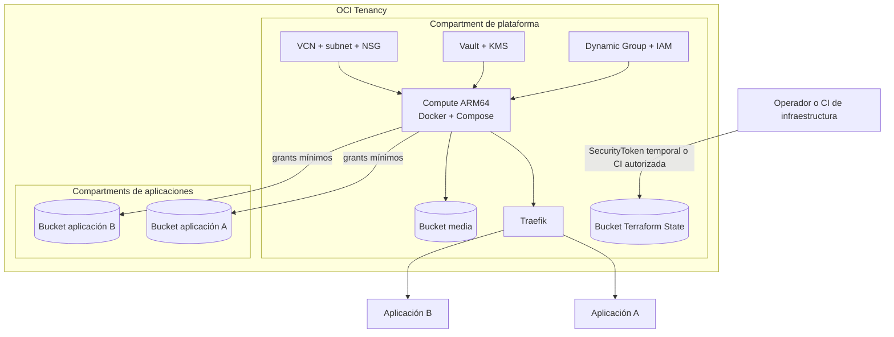

# Plataforma OCI Single VM Multi App

Arquitectura de referencia para alojar varias aplicaciones propias en una única
instancia OCI Compute con Docker Compose y Traefik. Está basada en el despliegue
de NuevaMente, pero utiliza nombres y parámetros genéricos para poder adaptarla a
otros proyectos.

Esta carpeta no duplica Terraform. Compone los root modules existentes, que son
la única fuente de verdad:

- [`oci/platform-bootstrap`](../../platform-bootstrap/);
- [`oci/docker-platform`](../../docker-platform/);
- [`oci/application-storage`](../../application-storage/), cuando una aplicación
  necesita un bucket con ciclo de vida independiente.

## Cuándo utilizarla

Es adecuada para proyectos propios, demos y entornos de desarrollo donde:

- varias aplicaciones pueden compartir una VM y un proxy inverso;
- se priorizan costo bajo y operación sencilla;
- cada aplicación conserva su repositorio, imagen y configuración runtime;
- los datos y el state necesitan propietarios separados;
- no se requiere aislamiento fuerte entre equipos o clientes.

No es una plataforma multi-tenant. Las aplicaciones comparten host, kernel,
runtime de contenedores, capacidad y parte de la red. Para cargas con distintos
dominios de confianza deben utilizarse instancias, compartments o plataformas
separadas.

## Componentes



## Ownership y states

| Responsabilidad | Root module | State |
|---|---|---|
| Compartment y bucket de Terraform State | `oci/platform-bootstrap` | Local, sensible y respaldado fuera de Git |
| Red, Compute, IAM, Vault, proxy y bucket media | `oci/docker-platform` | Remoto e independiente por entorno |
| Bucket y policy de una aplicación | Una ejecución independiente de `oci/application-storage` | Remoto y separado por aplicación |

`oci/terraform-state` puede sustituir a `oci/platform-bootstrap` cuando el
compartment ya existe. Nunca deben ejecutarse ambos sobre el mismo bucket.

Un nombre incluido en `external_object_storage_buckets` sólo concede acceso a la
VM. No transfiere el bucket al state de `docker-platform`.

## Orden de despliegue

### 1. Autenticación temporal

Desde una terminal local con navegador:

```powershell
oci session authenticate `
  --region sa-saopaulo-1 `
  --profile-name TERRAFORM
```

El token permanece en el perfil local de OCI y no debe copiarse a Git.

### 2. Bootstrap de plataforma

Trabaja desde `oci/platform-bootstrap`:

```powershell
Copy-Item terraform.tfvars.example terraform.tfvars
terraform init
terraform fmt -check -recursive
terraform validate
terraform plan -out bootstrap.tfplan
```

Revisa el plan antes de ejecutar un apply autorizado. Conserva y respalda el
state local fuera del repositorio.

Los outputs proporcionan:

- OCID del compartment de plataforma;
- namespace de Object Storage;
- nombre del bucket de state;
- valores necesarios para el backend remoto.

### 3. Buckets con ciclo de vida independiente

Cuando una aplicación necesita su propio bucket, ejecuta
`oci/application-storage` como root module independiente. Parte de:

- [`terraform.tfvars.example`](../../application-storage/terraform.tfvars.example);
- [`backend.oci.tfbackend.example`](../../application-storage/backend.oci.tfbackend.example).

Crea una instancia separada del state por aplicación. No reutilices el bucket
media ni el bucket de Terraform State.

Si el bucket ya existe y es administrado por otro proyecto, no lo importes a la
plataforma. Regístralo únicamente en `external_object_storage_buckets` con el
perfil mínimo necesario.

### 4. Plataforma Docker

Trabaja desde `oci/docker-platform` y copia los ejemplos del entorno elegido:

```powershell
Copy-Item `
  environments/dev/backend.oci.tfbackend.example `
  environments/dev/backend.oci.tfbackend

Copy-Item `
  environments/dev/terraform.tfvars.example `
  environments/dev/terraform.tfvars
```

Completa sólo los archivos ignorados. Para `dev`:

```powershell
terraform init -reconfigure `
  -backend-config=environments/dev/backend.oci.tfbackend

terraform fmt -check -recursive
terraform validate
terraform plan `
  -var-file=environments/dev/terraform.tfvars
```

Antes de cualquier apply comprueba explícitamente que el plan no contenga
destrucciones ni reemplazos inesperados.

### 5. Aplicaciones

Las aplicaciones no se incorporan al state de infraestructura. Cada una debe:

- vivir en su propio repositorio;
- publicar una imagen compatible con la arquitectura de Compute;
- usar tags inmutables y, durante deployment, imágenes resueltas por digest;
- definir healthcheck, límites de CPU/memoria y controles de hardening;
- conectarse al proxy sólo mediante la configuración root-owned autorizada;
- recibir secretos en runtime desde un mecanismo fuera de Git.

La infraestructura puede habilitar OCIR y el deployment seguro más adelante. En
dev permanecen desactivados mientras no exista un flujo aprobado.

## Parámetros que deben cambiar por proyecto

No copies valores reales de otro despliegue. Define para cada proyecto:

| Decisión | Ejemplos de variables |
|---|---|
| Identidad | `project_name`, `environment_name`, tags |
| Límites administrativos | `compartment_ocid`, `compartment_name` |
| Red | `vcn_cidr`, `public_subnet_cidr`, `ssh_source_cidr` |
| Capacidad | `shape`, `ocpus`, `memory_in_gbs`, boot volume |
| Exposición | `https_enabled`, dominio y `acme_email` |
| Datos | nombres de buckets, versionado y lifecycle |
| Integraciones | `external_object_storage_buckets` |
| Operación | monitoring, logging, backups y registry |
| Deployment | principales autorizados y allowlist root-owned |

Los nombres deben ser genéricos en los módulos. Los nombres concretos de las
aplicaciones sólo viven en sus repositorios, en archivos locales o en la
configuración root-owned del host.

## Perfil de costo bajo

El perfil inicial de dev puede utilizar una instancia flexible pequeña y dejar
desactivados:

- Monitoring y Notifications adicionales;
- Logging centralizado;
- backups administrados;
- OCI Container Registry;
- deployment mediante Run Command;
- versionado y lifecycle destructivo de buckets de aplicaciones.

Esto reduce consumo, pero no garantiza costo cero. Los límites de Always Free se
comparten en el tenancy y pueden cambiar. Antes de desplegar revisa cuotas de
Compute, Block Volume, Object Storage, Vault, transferencia y servicios
opcionales.

## Seguridad base

- Los buckets permanecen privados.
- Terraform State nunca se comparte con aplicaciones.
- La VM usa Instance Principal y policies limitadas por recurso.
- SSH debe restringirse a una IP o red administrativa; `0.0.0.0/0` es sólo un
  ejemplo de laboratorio y Policy as Code lo reporta.
- Producción exige HTTPS y controles operativos más estrictos.
- `terraform.tfvars`, backends reales, state, planes, tokens y claves permanecen
  fuera de Git.
- Compartir una VM no proporciona aislamiento frente a una imagen maliciosa.

## Validación mínima

Antes de proponer cambios:

```powershell
terraform fmt -check -recursive
terraform init -backend=false
terraform validate
```

Ejecuta además las pruebas de Policy as Code, Container Hardening y validación
YAML/Python del repositorio. Con autenticación y archivos reales disponibles,
ejecuta un plan contra el state del entorno y verifica:

```text
0 to destroy
0 replacements inesperados
```

Una validación estática no demuestra que el plan real sea seguro.

## Checklist para reutilizar la arquitectura

1. Definir propietario, entorno, región y presupuesto.
2. Decidir si se crea un compartment nuevo o se usa uno existente.
3. Crear un bucket de state dedicado mediante un único bootstrap.
4. Definir claves de backend independientes para dev, staging y prod.
5. Elegir CIDRs sin superposición y restringir SSH.
6. Seleccionar capacidad Compute compatible con las imágenes.
7. Decidir qué buckets pertenecen a plataforma y cuáles a aplicaciones.
8. Conceder acceso externo mediante IAM mínimo, sin transferir ownership.
9. Revisar Policy as Code y el plan real antes de aplicar.
10. Verificar cloud-init, Docker, Traefik e idempotencia posterior.
11. Incorporar aplicaciones mediante Compose root-owned y healthchecks.
12. Habilitar observabilidad, backups, logging y registry sólo cuando el riesgo,
    costo y operación lo justifiquen.

## Caso validado

La primera implementación de este patrón está documentada en
[`oci/case-studies/nuevamente-dev-oci.md`](../../case-studies/nuevamente-dev-oci.md).
Ese documento registra decisiones y resultados de un despliegue real; esta guía
es la versión genérica para futuros proyectos.
